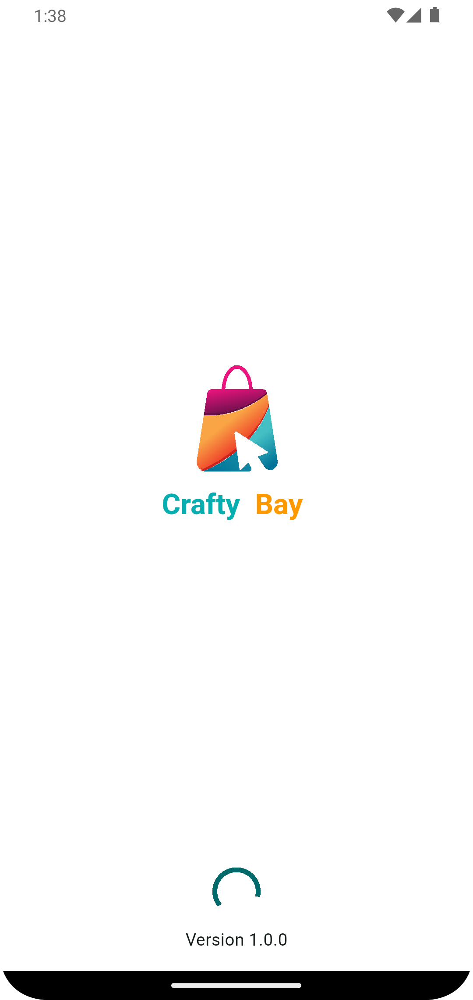
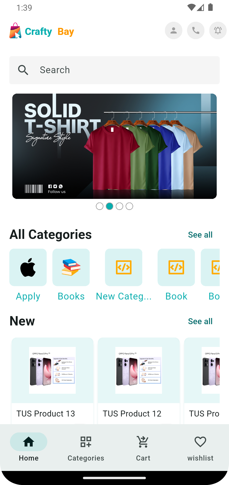
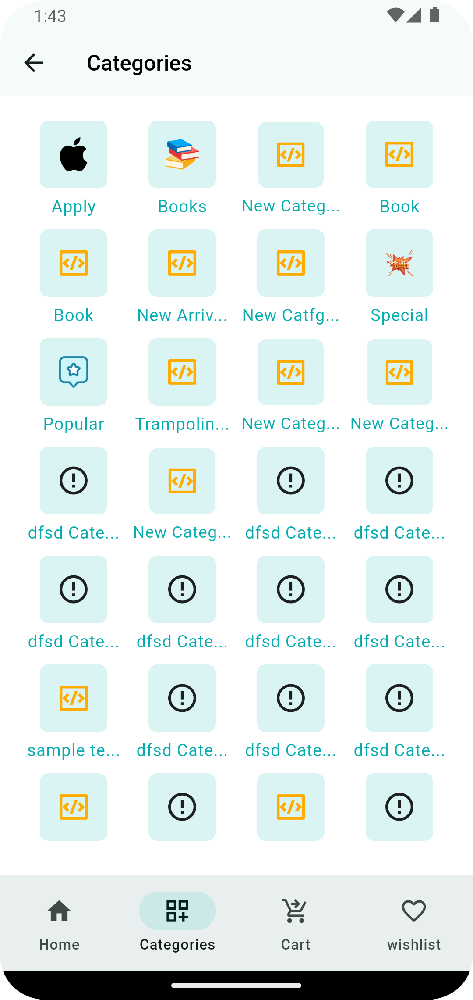
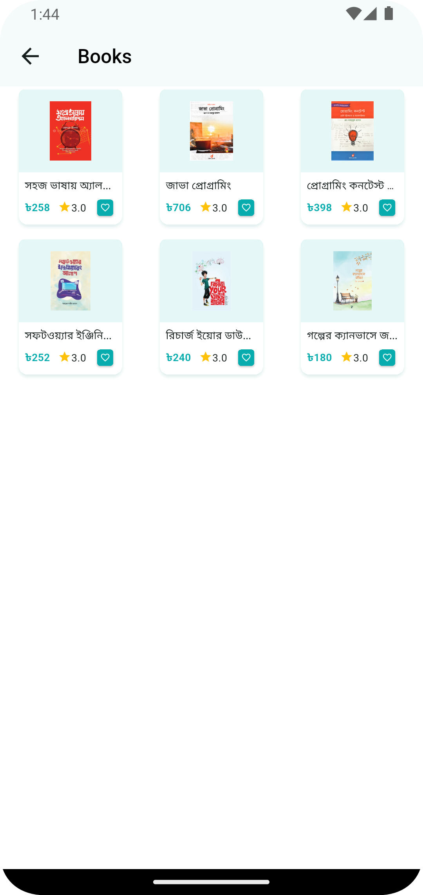
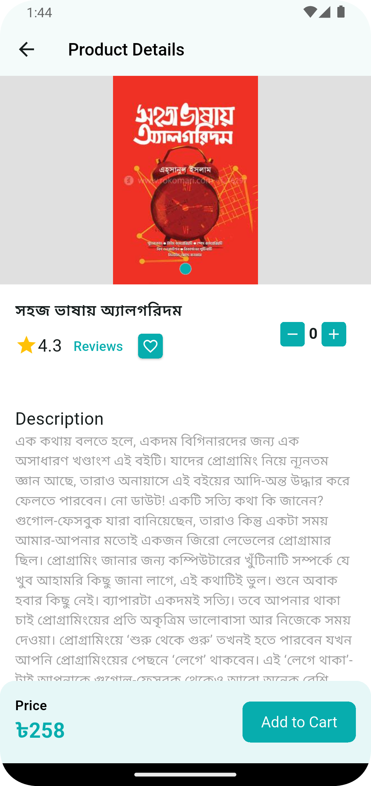
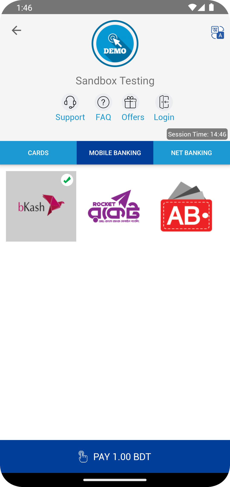
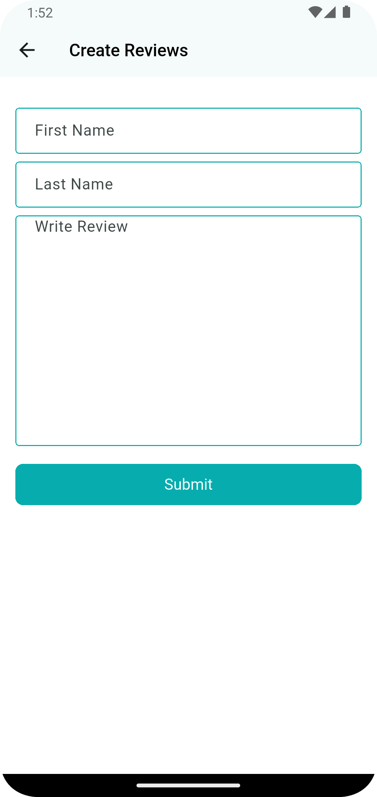
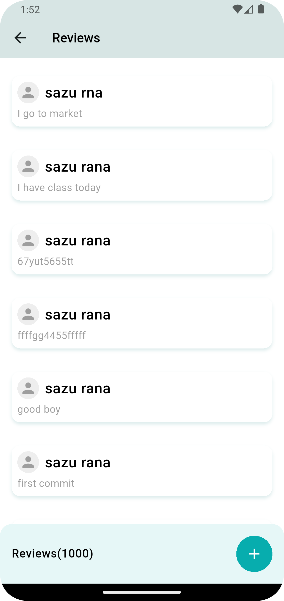

# About Crafty-Bay

A full-featured E-commerce application built with Flutter, featuring user Authentication, Rest api integration, Add to cart, Deleting a product from the cart, Add review, Delete review and a modern, responsive UI.In this e-commerce project, a feature-fast architecture has been used. As a result, we can easily add or delete any feature.

## 📱 Screenshots

<table>
  <tr>
    <td>
      <br/>
      <em>Login Screen</em>
    </td>
    <td>
      <br/>
      <em>Sign Up Screen</em>
    </td>
    <td>
      <br/>
      <em>OTP Verification</em>
    </td>
  </tr>
  <tr>
    <td>
      <br/>
      <em>Splash Screen</em>
    </td>
    <td>
      <br/>
      <em>Home Screen</em>
    </td>
    <td>
      <br/>
      <em>Category Screen</em>
    </td>
  </tr>
   <tr>
    <td>
      <br/>
      <em>Product Screen</em>
    </td>
    <td>
      <br/>
      <em>Product Details Screen</em>
    </td>
    <td>
      <br/>
      <em>Cart Screen</em>
    </td>
  </tr>
  <tr>
    <td>
      <br/>
      <em>Payment Gateway Screen</em>
    </td>
    <td>
      <br/>
      <em>Add Review Screen</em>
    </td>
    <td>
      <br/>
      <em>Review Screen</em>
    </td>
  </tr>
  </table>

  ## ✨ Features

### 🔐 Authentication System
- **User Registration** - Complete sign-up flow with form validation
- **Secure Login** - Email/password authentication
- **OTP Verification** - 4-digit PIN verification system


## Crafty Bay E-commerce App
- **Add To Cart** - Add product to cart 
- **Delete Item Cart** - Delete product from cart
- **Cart Item Increment/Decrement** - Increment/decrement products from cart
- **Payment Gateway** - This project uses the SSLcommerz payment system
- **Localization Setup** - Basic localization setup
- **Add Review** - You can give a review about the product.
- **View Product** - Visit the products and see the functionality.
- **Main Navigation Bar** - This project uses a different bottom navigation bar:
    - Home
    - Category
    - Cart
    - Wishlist
 
### 🎨 User Experience
- **Modern UI Design** - Clean and intuitive interface
- **Responsive Layout** - Optimized for different screen sizes
- **View Prodect** - Visit the products and see the functionality 
- **User-friendly Navigation** - Smooth transitions and interactions
- **Professional Styling** - Consistent color scheme and typography

## 🛠️ Tech Stack

| Technology            | Purpose                                 |
|-----------------------|-----------------------------------------|
| **Flutter**           | Cross-platform mobile app framework     |
| **Dart**              | Primary programming language            |
| **REST API**          | Backend communication and data handling |
| **POST MAN**          | To Handel api calls                     |
| **HTTP Package**      | API requests and responses              |
| **SharedPreferences** | Local data storage                      |
| **Form Validation**   | Input validation and error handling     |
| **Localization**      | Basic localization setup                |

## 📁 Project Structure

```
crafty_bay_app/
├───lib
│   │   firebase_options.dart
│   │   main.dart
│   │
│   ├───app
│   │   │   app.dart
│   │   │   app_colors.dart
│   │   │   app_theme.dart
│   │   │   assets_paths.dart
│   │   │   controller_binder.dart
│   │   │   routes.dart
│   │   │   set_up_network_client.dart
│   │   │   urls.dart
│   │   │
│   │   ├───controllers
│   │   │       authentication_controller.dart
│   │   │       language_controller.dart
│   │   │
│   │   ├───extensions
│   │   │       localization_extension.dart
│   │   │
│   │   └───utils
│   │           app_version_service.dart
│   │           constants.dart
│   │
│   ├───core
│   │   ├───models
│   │   │       network_response.dart
│   │   │
│   │   └───services
│   │           network_caller.dart
│   │
│   ├───features
│   │   ├───auth
│   │   │   ├───data
│   │   │   │   └───models
│   │   │   │           sign_in_request_model.dart
│   │   │   │           sign_up_request_model.dart
│   │   │   │           verify_otp_request_model.dart
│   │   │   │
│   │   │   └───presentation
│   │   │       ├───controller
│   │   │       │       sign_in_controller.dart
│   │   │       │       sign_up_controller.dart
│   │   │       │       verify_otp_controller.dart
│   │   │       │
│   │   │       ├───screens
│   │   │       │       sign_in_screen.dart
│   │   │       │       sign_up_screen.dart
│   │   │       │       splash_screen.dart
│   │   │       │       verify_otp_screen.dart
│   │   │       │
│   │   │       └───widgets
│   │   │               app_logo.dart
│   │   │
│   │   ├───carts
│   │   │   ├───data
│   │   │   │   └───models
│   │   │   │           cart_item_model.dart
│   │   │   │
│   │   │   └───presentation
│   │   │       ├───controllers
│   │   │       │       cart_list_controller.dart
│   │   │       │
│   │   │       ├───screens
│   │   │       │       cart_screen.dart
│   │   │       │
│   │   │       └───widgets
│   │   │               cart_item.dart
│   │   │               total_price_and_checkout_section.dart
│   │   │
│   │   ├───category
│   │   │   └───presentation
│   │   │       └───screens
│   │   │               category_list_screen.dart
│   │   │
│   │   ├───home
│   │   │   ├───data
│   │   │   │   └───models
│   │   │   │           home_slider_model.dart
│   │   │   │
│   │   │   ├───presentation
│   │   │   │   ├───controller
│   │   │   │   │       home_slider_controller.dart
│   │   │   │   │
│   │   │   │   └───screens
│   │   │   │           home_screen.dart
│   │   │   │
│   │   │   └───widgets
│   │   │           app_bar_icon_button.dart
│   │   │           home_banner_slider.dart
│   │   │
│   │   ├───products
│   │   │   └───presentation
│   │   │       ├───controllers
│   │   │       │       add_to_cart_controller.dart
│   │   │       │       new_product_list_controller.dart
│   │   │       │       popular_product_list_controller.dart
│   │   │       │       product_details_controller.dart
│   │   │       │       product_list_controller.dart
│   │   │       │       special_product_list_controller.dart
│   │   │       │
│   │   │       ├───screens
│   │   │       │       product_details_screen.dart
│   │   │       │       product_list_screen.dart
│   │   │       │
│   │   │       └───widgets
│   │   │               color_picker.dart
│   │   │               product_image_slider.dart
│   │   │               size_picker.dart
│   │   │               total_price_and_cart_section.dart
│   │   │               total_review_and_add_section.dart
│   │   │
│   │   ├───review
│   │   │   ├───data
│   │   │   │   └───models
│   │   │   │           add_review_model.dart
│   │   │   │           review_model.dart
│   │   │   │
│   │   │   └───presentation
│   │   │       ├───controllers
│   │   │       │       add_review_controller.dart
│   │   │       │       review_list_controller.dart
│   │   │       │
│   │   │       └───screens
│   │   │               add_review.screen.dart
│   │   │               review_list_screen.dart
│   │   │
│   │   ├───shared
│   │   │   ├───data
│   │   │   │   └───models
│   │   │   │           category_model.dart
│   │   │   │           product_details_model.dart
│   │   │   │           product_model.dart
│   │   │   │           user_model.dart
│   │   │   │
│   │   │   └───presentation
│   │   │       ├───controller
│   │   │       │       category_controller.dart
│   │   │       │       main_nav_controller.dart
│   │   │       │
│   │   │       ├───screens
│   │   │       │       bottom_nav_holder_screen.dart
│   │   │       │
│   │   │       └───widgets
│   │   │               centered_circular_progress.dart
│   │   │               increment_decrement_button.dart
│   │   │               language_change_switch.dart
│   │   │               product_card.dart
│   │   │               product_category_item.dart
│   │   │               snackbar_message.dart
│   │   │
│   │   └───wishlish
│   │       ├───controllers
│   │       │       wish_list_controller.dart
│   │       │
│   │       ├───data
│   │       │   └───models
│   │       │           wishlist_model.dart
│   │       │
│   │       └───presentation
│   │           └───screens
│   │                   wish_list_screen.dart
│   │
│   └───l10n
│           app_bn.arb
│           app_en.arb
│           app_localizations.dart
│           app_localizations_bn.dart
│           app_localizations_en.dart


  


