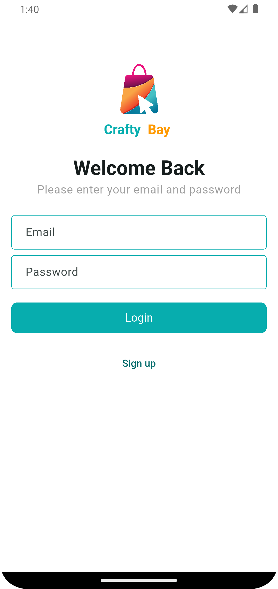
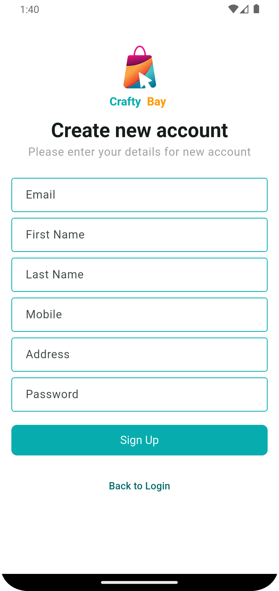
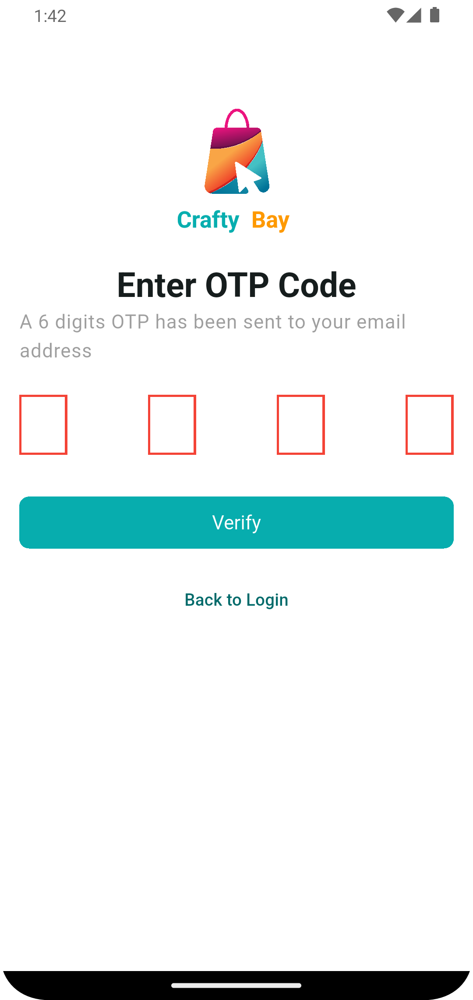

# About Crafty-Bay

A full-featured E-commerce application built with Flutter, featuring user Authentication, Rest api integration, Add to cart, Deleting a product from the cart, Add review, Delete review and a modern, responsive UI.In this e-commerce project, a feature-fast architecture has been used. As a result, we can easily add or delete any feature.

## 📱 Screenshots

<table>
  <tr>
    <td>
       
      <em>Login Screen</em>
    </td>
    <td>
       
      <em>Sign Up Screen</em>
    </td>
    <td>
       
      <em>Email Verification</em>
    </td>
  </tr>
  </table>

  ## ✨ Features

### 🔐 Authentication System
- **User Registration** - Complete sign-up flow with form validation
- **Secure Login** - Email/password authentication
- **OTP Verification** - 4-digit PIN verification system

## Crafty Bay E-commerce App
- **Add To Cart** - Add product to cart 
- **Delete Item Cart** - Delete product from cart
- **Cart Item Increment/Decrement** - Increment/decrement products from cart
- **Payment Gateway** - This project uses the SSLcommerz payment system
- **Localization Setup** - Basic localization setup
- **Add Review** - You can give a review about the product.
- **View Product** - Visit the products and see the functionality.
- **Main Navigation Bar** - This project uses a different bottom navigation bar:
    - Home
    - Category
    - Cart
    - Wishlist
 
### 🎨 User Experience
- **Modern UI Design** - Clean and intuitive interface
- **Responsive Layout** - Optimized for different screen sizes
- **View Prodect** - Visit the products and see the functionality 
- **User-friendly Navigation** - Smooth transitions and interactions
- **Professional Styling** - Consistent color scheme and typography

## 🛠️ Tech Stack

| Technology            | Purpose                                 |
|-----------------------|-----------------------------------------|
| **Flutter**           | Cross-platform mobile app framework     |
| **Dart**              | Primary programming language            |
| **REST API**          | Backend communication and data handling |
| **POST MAN**          | To Handel api calls                     |
| **HTTP Package**      | API requests and responses              |
| **SharedPreferences** | Local data storage                      |
| **Form Validation**   | Input validation and error handling     |
| **Localization**      | Basic localization setup                |

  

